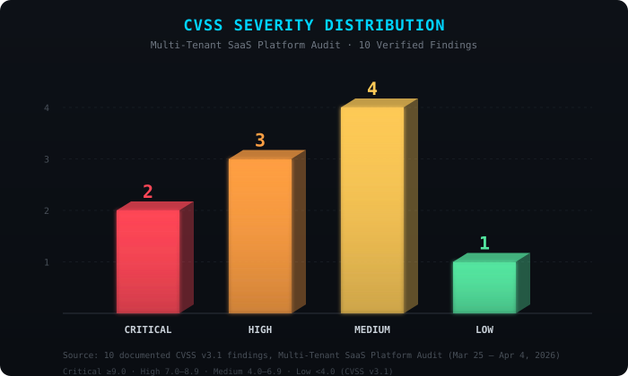
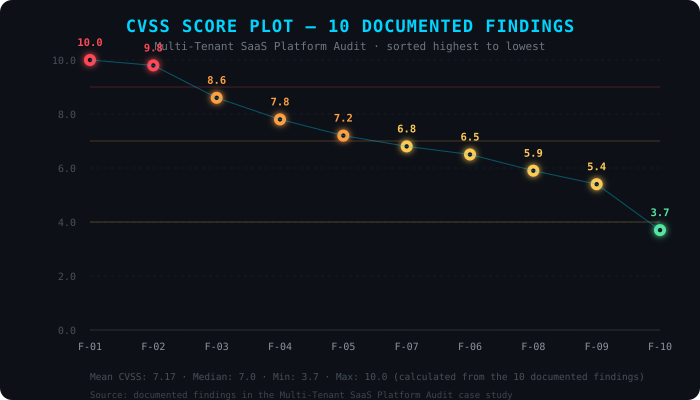

<h2>PUNEET CHANDRA CHAUDHARY</h2>
<h4>Cybersecurity Researcher · Penetration Tester · Bug Hunter</h4>

📍 Gorakhpur, Uttar Pradesh, India 🇮🇳

 

 

## 🔐 Identity

I'm a hands-on cybersecurity researcher and penetration tester — I find real vulnerabilities in production systems, verify every one by hand, and report them the responsible way. By day I teach **Biology (B.Sc. Zoology)**; security is the discipline I built myself, **8 years** of self-taught, hands-on work with no formal certification. Everything documented here was learned by doing it, not by reading about it.

I care about **offensive-defensive development** — understanding how an attack works closely enough to build a real defense from it — and every tool I release stays **free**, needing no paid API and no money to use, because that's the wall I hit when I was learning.

 

## 🎯 Research Focus

<table width="100%">
<tr>
<td width="25%" align="center">

**🌐 Web App Security**
IDOR · Auth Bypass · Black-box Testing

</td>
<td width="25%" align="center">

**🔌 API Security**
Endpoint Enumeration · Zero-Auth Detection

</td>
<td width="25%" align="center">

**☁️ Cloud / Firebase**
Admin SDK Exposure · Config Review

</td>
<td width="25%" align="center">

**🏗️ Infrastructure**
Port/Service Enumeration · Server Hardening

</td>
</tr>
</table>

**Methodology:** OWASP Top 10 · OWASP WSTG v4.2 · CVSS v3.1 Scoring · Responsible Disclosure
**Verification standard:** tools for speed, my own eyes on every single finding — that's how false alarms stay near zero.

 

---

## 📊 Skill Proficiency

Self-assessed proficiency, not a certified measurement.

 

---

## 🛡️ Featured Research: Multi-Tenant SaaS Platform Audit

**Full black-box security audit** · Confidential Security Research · April 2026

| Scope | Detail |
|---|---|
| Target | Multi-tenant attendance SaaS (PHP / JavaScript / Firebase) |
| User base | 100+ institutions, 1000+ employees |
| Method | Black-box — no login, no inside knowledge, started from zero |
| Result | **10 verified vulnerabilities**, reported the right way |
| Report | 27-page written disclosure |

### Findings

| ID | Vulnerability | CVSS | Severity |
|:--:|---|:--:|:--:|
| F-01 | Firebase Admin SDK private key sitting out in the open | 10.0 | 🔴 Critical |
| F-02 | Admin panel login could be skipped from the browser | 9.8 | 🔴 Critical |
| F-03 | Directory listing exposed 30+ backend PHP files | 8.6 | 🟠 High |
| F-04 | 685 face photos, no login needed to view them | 7.8 | 🟠 High |
| F-05 | Error logs leaking server paths & dev setup | 7.2 | 🟠 High |
| F-06 | IDOR — anyone could pull employee attendance data | 6.5 | 🟡 Medium |
| F-07 | WHM root admin panel open to the public internet | 6.8 | 🟡 Medium |
| F-08 | FTP with no encryption + 18 open ports | 5.9 | 🟡 Medium |
| F-09 | 30+ API endpoints with zero authentication | 5.4 | 🟡 Medium |
| F-10 | Missing basic HTTP security headers | 3.7 | 🟢 Low |

Calculated from the 10 documented findings — Mean CVSS: 7.17 · Median: 7.0 · Min: 3.7 · Max: 10.0

<b>🔎 Critical findings, the full story</b>

 

**Firebase Admin key exposed**
- Found the RSA-2048 service-account key sitting in a public `/backend/` folder
- That one file gives full read/write access to every employee record, biometric photo, and tenant's data
- Confirmed it live — pulled it straight off the server, no login required (HTTP 200)

**Admin panel login was fake**
- The "check" only ran in the browser (localStorage). The server handed over the full admin page either way
- One command in the browser console, under 60 seconds, and you're in as admin
- That gets you employee PII, salaries, attendance history, and admin controls

**Face photos exposed**
- 685 employee face photos, downloadable in bulk with a plain `wget` command, no login
- This alone counts as a notifiable data breach under India's DPDP Act, 2023

**Source code & server info leaking**
- Directory listing on 30+ PHP files; error logs spilling dev file paths, stack traces, even GPS/address data

**IDOR**
- One dashboard endpoint returned attendance stats for any company code you typed in — no auth check at all
- Tested against real data (24 employees); scales to every tenant on the platform

**Server itself was wide open**
- Root admin panel on port 2087, 18 open ports, FTP sending passwords in plain text, unlocked LiteSpeed admin panel

<b>⚙️ How I did it, step by step</b>

 

**7-step process:** Recon (Nmap, WhatWeb, Katana, GoWitness) → scan ports and services → find hidden directories (FFUF, Gobuster, Dirbuster) → test the app by hand (Burp Pro) → dig into the API (curl, jq, Postman) → run an active scan (OWASP ZAP) → confirm everything live without breaking anything.

**Zero to full takeover, ~15 minutes, browser + curl only, no login at any point:**
1. Find open directory listing, spot the PHP files and Firebase key (F-03)
2. Grab the Firebase Admin key for full backend access (F-01)
3. Pull every user record straight from the Admin SDK
4. Flip one value in `localStorage` and walk into the admin panel (F-02)
5. Hit the `dashboard_stats` endpoint for attendance data on any company (F-06)
6. Browse the uploads folder, download all 685 face photos (F-04)
7. Read the error logs for the DB schema, dev paths, GPS data (F-05)
8. Firebase FCM could be abused to push fake notifications to every user
9. WHM login was weak enough for brute-force, full server takeover (F-07)

**Bottom line:** Tested from March 25 to April 4, 2026. Every finding double-checked by hand. Nothing copied, changed, or kept afterward. Reportable under India's DPDP Act 2023, IT Act 2000 §43A, GDPR Article 25/32, and ISO/IEC 27001:2022.

**Skills used:** OWASP WSTG v4.2 testing, CVSS v3.1 scoring, starting from zero and still finding a way in, app and server-level analysis, Firebase/cloud security, handling biometric data properly, responsible disclosure, explaining risk in business terms, evidence collection that holds up for legal review.

 

---

## 🛡️ Case Study: Institutional Portal, Full Database Exposed

**Web app security check** · Confidential Security Research · Client name withheld on request

| Scope | Detail |
|---|---|
| Target | A school/institution management portal (student & staff records, attendance, academic data, notices) |
| Method | Logged in as a normal user, then tested the query parameters |
| Result | **Critical SQL injection**, reported and fixed |

| Vulnerability | CVSS | Severity | Status |
|---|:--:|:--:|:--:|
| SQL Injection — one user could read every other session's data | 9.1 | 🔴 Critical | ✅ Reported & Fixed |

<b>🔎 The details</b>

 

- One endpoint built its database query carelessly, letting it reach far past what it was supposed to touch
- Any logged-in user could pull data from tables well outside their own account — basically full read access to the entire database (student/staff records, academic and attendance data, internal messages)
- Confirmed the impact with careful, targeted queries. No mass downloads, nothing kept
- Reported the issue privately with a fix guide attached. Now **patched and confirmed working**
- Nothing beyond what was needed to prove the bug was ever saved

**Skills used:** spotting and scoping SQL injection, understanding session/authorization boundaries, verifying impact without causing damage, explaining a serious bug clearly to a non-technical client.

 

---

## 🧭 Research Pipeline

 

---

## 💻 Tech Arsenal

| Category | Go-To Tools |
|:---------|:---|
| **Recon** | Nmap, WhatWeb, Amass, Katana, GoWitness |
| **Web** | Burp Suite Pro, OWASP ZAP |
| **Directory Discovery** | Gobuster, FFUF, Dirbuster, feroxbuster, DirSearch |
| **API** | curl + jq, Postman + Newman, GraphQL testing, custom IDOR scripts |
| **Network** | Nmap, OpenSSL, Wireshark, proxy-chain analysis |
| **Cloud** | Firebase Admin SDK review |
| **Database** | SQLMap, SQL, PostgreSQL |
| **Automation** | Python, Bash, custom scripting |
| **Analysis / Reporting** | CVSS calculator, Shodan, Censys, WHOIS/DNS tools, ExifTool |

<b>🛠️ Automation I've built myself</b>

 

- **Burp Pro workflows:** custom Intruder payload lists with grep-based anomaly checks, Repeater templates for API fuzzing, macros for automated login/session flows
- **Directory enumeration pipeline:** Gobuster → FFUF → Dirbuster, with wordlists auto-built from a target's JS files and error messages
- **API testing scripts:** curl/jq endpoint enumeration, IDOR detection by cycling through IDs and company codes, pagination-aware bulk extraction
- **Python tools:** an IDOR scanner, an auth-bypass tester (localStorage/JWT fuzzing), a biometric-data analyzer (EXIF/timestamp correlation), a CVSS score calculator

**Where I practice:** HackTheBox, TryHackMe, PortSwigger Web Academy, DVWA/WebGoat

 

---

## 🚀 Flagship Projects

<table>
<tr>
<td width="50%" valign="top">

### 👁️ PhantomEye
**Browser-based media capture & session research framework**

| | |
|---|---|
| Purpose | Session-based media capture research |
| Tech | PHP · Bash · JavaScript |
| Environment | Kali, Termux, Windows |
| Context | Security-awareness demos, authorized research only |

- Built around sessions, handles media in chunks
- Live preview while it processes

</td>
<td width="50%" valign="top">

### 🛡️ QR-SHIELD v1.5
**A modular, stable local lab for QR-login session hijacking research**

| | |
|---|---|
| Purpose | Modular framework for QR-login session hijacking research, built beyond the classic (now largely outdated) QRLJacking technique |
| Tech | Python |
| Environment | Sandboxed, localhost-only |
| Context | Offline research — no real platform ever touched |

- Modular, stable architecture — more advanced than a basic QRLJacking-style setup
- Models the risk that can hit QR-based logins on apps like WhatsApp Web, Telegram, Discord, and Signal if built carelessly
- Named "Shield" on purpose — understand the attack well enough to help others defend against it

</td>
</tr>
</table>

<b>🔬 QR-SHIELD, what I'm researching next</b>

 

**Digging into:** QR encoding/decoding flaws, the timing windows during login, session validation bypass, how different platforms implement QR login differently, real-world resilience testing — all inside a local, offline lab, never against a live service.

**Not doing:** another generic vulnerability scanner or a catch-all security suite — staying focused on this one problem.

**Approach:** understand modern QR login deeply first, build tools for local and authorized research, then share what's learned so others can build better defenses.

**Status:** both projects are in active development and testing.

 

---

## 📊 GitHub Analytics

 

---

## 🎯 Current Research

| Status | Item |
|:--:|---|
| ✅ Done | Multi-tenant SaaS security assessment (27-page report) |
| 🔄 Active | PhantomEye v2.0 (live streaming, stability work), QR-SHIELD v1.5 advanced modules |
| 📝 Pipeline | Write-up on QR authentication bypass research, a bug bounty toolkit and automation suite, documentation for past pentest case studies |
| ⊘ Not building | Generic vulnerability scanners or all-in-one security suites — staying focused on specialized research |

 

---

## ⚖️ How I Work

| Principle | What it means |
|---|---|
| **Permission first** | I only test with clear authorization or a signed agreement |
| **Responsible disclosure** | Report privately, follow a 90-day coordinated timeline |
| **Minimal data exposure** | Never touch or keep data beyond what's needed to prove the bug |
| **Evidence-based validation** | Tools for speed, my own eyes on every finding |
| **Transparent reporting** | Clear reports with fix guidance and evidence that holds up |

*Every piece of security research here is done with one goal: protect users and make the organizations I test safer.*

 

---

### 💡 Philosophy

> "To understand defense, you have to think like an attacker.
> To be a good attacker, you have to understand defense.
> To teach security, you need to master both."
> — D0C70R

**`FIND → FIX → UNDERSTAND → DEFEND → TEACH → REPEAT`**

 

### 📬 Get in Touch

⭐ Star my repos · 🔗 Share my research · 💬 Reach out if you want to collaborate

**Last Updated:** September 2026 · 🟢 Active in Pentesting & Research

